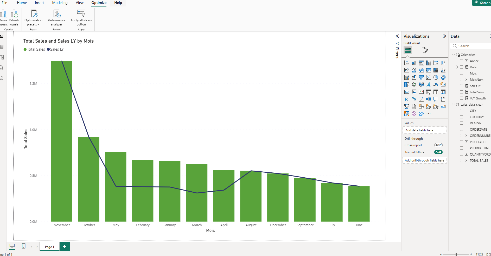

#  E-commerce Sales Performance Analysis

##  Project Overview
This project provides a comprehensive analysis of e-commerce sales data, focusing on Year-over-Year (YoY) growth and regional performance.

##  Dashboard Preview

##  Key Insights
* **Performance Tracking:** Used DAX to compare current sales vs. Last Year (LY).
* **Data Cleaning:** Automated ETL process using Python (Pandas).
* **Interactive Design:** Dynamic filtering by year, country, and product category.